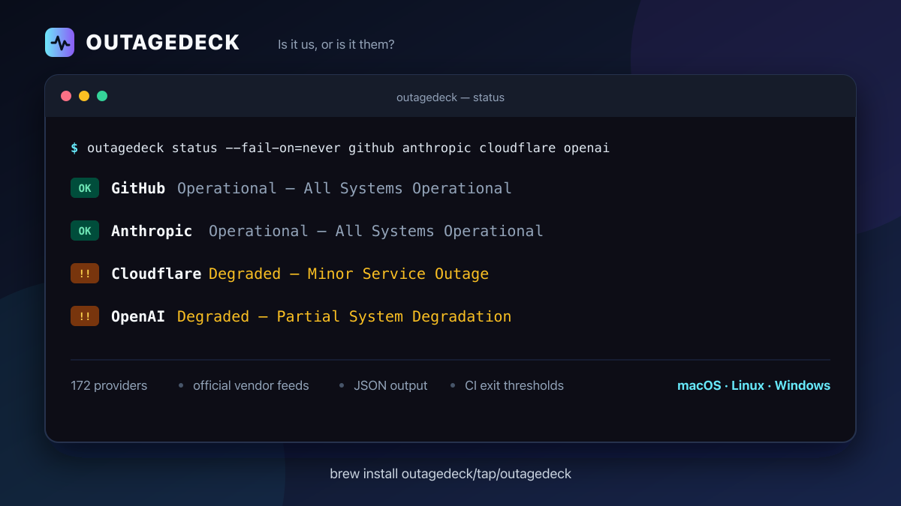

# OutageDeck CLI

[](https://outagedeck.com?utm_source=github&utm_medium=repository&utm_campaign=cli_distribution)

[](https://github.com/outagedeck/cli/releases/latest)
[](LICENSE)
[](https://codespaces.new/outagedeck/cli?quickstart=1)



Check cloud and SaaS provider status from a terminal or CI script. OutageDeck normalizes each vendor's official machine-readable status feed; it does not replace synthetic monitoring.

## Install

```bash
brew install outagedeck/tap/outagedeck
```

With [MacPorts](https://ports.macports.org/port/outagedeck/):

```bash
sudo port install outagedeck
```

With [Hermit](https://cashapp.github.io/hermit/) on macOS or Linux:

```bash
hermit install outagedeck
```

With [binenv](https://github.com/devops-works/binenv) on macOS or Linux:

```bash
binenv update -d
binenv update -f outagedeck
binenv install outagedeck
```

With [mise](https://mise.jdx.dev/):

```bash
mise use -g github:outagedeck/cli@0.1.3
```

With Nix:

```bash
nix run github:outagedeck/cli -- --version
```

From the multi-architecture container image:

```bash
docker run --rm ghcr.io/outagedeck/cli:0.1.3 status --fail-on=never github cloudflare
```

The image runs as a non-root user, has no shell or package manager, and is published for Linux AMD64 and ARM64 with provenance and an SBOM.

In a Dev Container or Codespace, use the published [Dev Containers Extra feature](https://github.com/devcontainers-extra/features/tree/main/src/outagedeck):

```json
"features": {
  "ghcr.io/devcontainers-extra/features/outagedeck:1": {}
}
```

Or launch the repository's ready-to-use configuration with [GitHub Codespaces](https://codespaces.new/outagedeck/cli?quickstart=1); it installs the current OutageDeck release automatically.

On Windows with WinGet:

```powershell
winget install --id OutageDeck.CLI --exact
```

Or with Scoop:

```powershell
scoop bucket add outagedeck https://github.com/outagedeck/scoop-bucket
scoop install outagedeck
```

Or install from source:

```bash
go install github.com/outagedeck/cli/cmd/outagedeck@latest
```

Already use GitHub CLI? The companion extension defaults to GitHub provider and service health:

```bash
gh extension install outagedeck/gh-outagedeck
gh outagedeck
```

Release archives for macOS, Linux, and Windows are available on the [releases page](https://github.com/outagedeck/cli/releases).

## Use

```console
$ outagedeck status aws cloudflare github openai
OK AWS: Operational — All Systems Operational
OK Cloudflare: Operational — All Systems Operational
OK GitHub: Operational — All Systems Operational
!! OpenAI: Degraded — OpenAI reports an active incident
```

Find a provider slug:

```console
$ outagedeck search "Claude"
anthropic                operational        Anthropic
```

Turn a checked dependency stack into a prefilled alert setup:

```console
$ outagedeck alerts aws cloudflare github openai
Set up alerts for aws, cloudflare, github, openai:
https://outagedeck.com/account?stack=aws%2Ccloudflare%2Cgithub%2Copenai&utm_campaign=cli_distribution&utm_content=alerts_command&utm_medium=terminal&utm_source=cli
```

Free email alerts cover up to five providers, and the selected stack survives the email sign-in round trip.

Use structured output in scripts:

```bash
outagedeck status --json --fail-on=outage aws github openai
```

The status command exits with:

- `0` when every provider is below the selected threshold;
- `1` when a request or argument fails;
- `2` when at least one provider meets the selected threshold.

`--fail-on` accepts `degraded` (default), `outage`, `major_outage`, or `never`. Set `OUTAGEDECK_API_KEY` or pass `--api-key` for a higher API quota.

## Data and trust

- Data comes from official vendor status feeds and is refreshed about every 10 minutes.
- An unreachable or malformed response is an error, never `operational`.
- The public API allows 120 requests per hour. The CLI checks up to 20 providers concurrently.
- No telemetry is added by the CLI. Requests identify the client through a standard `User-Agent` header.

Review the [API documentation](https://outagedeck.com/developers/api?utm_source=github&utm_medium=repository&utm_campaign=cli_distribution) or run `outagedeck alerts` with the providers you want to watch.

## License

MIT
